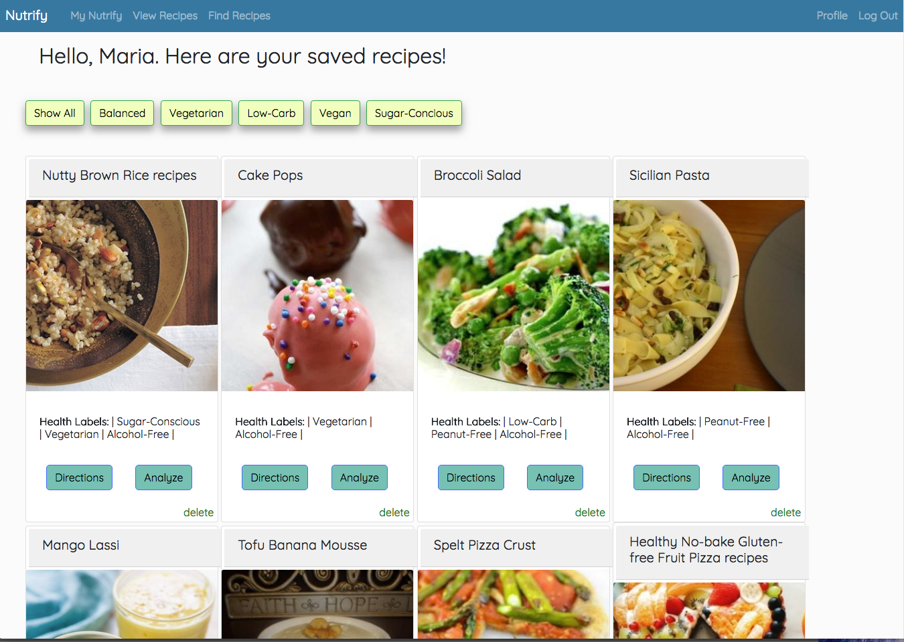
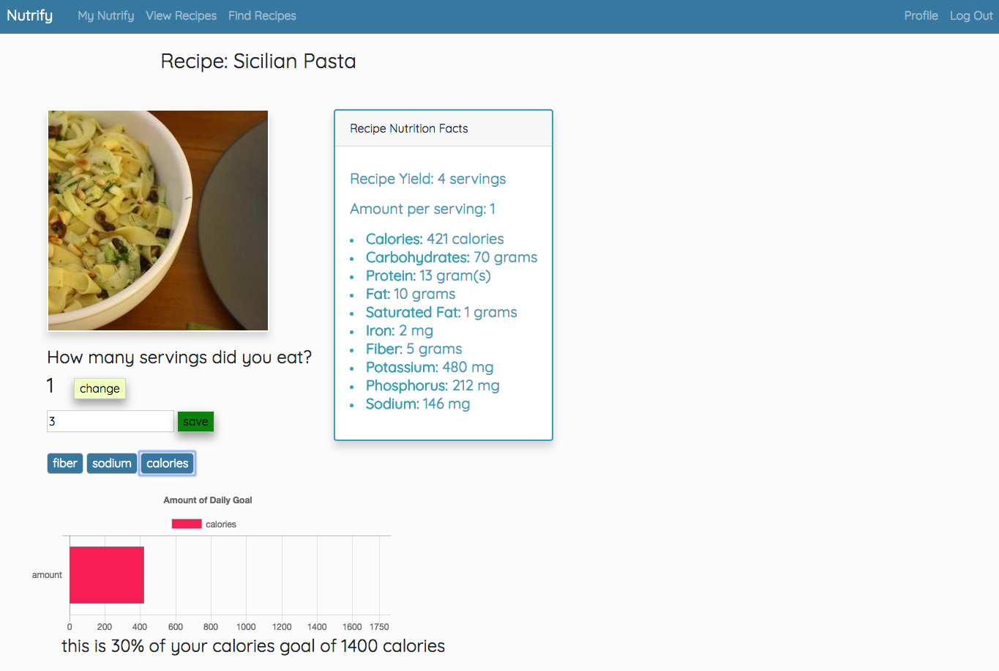

# Nutrify 

  Nutrify helps users find recipes based on diet restrictions and preferences, providing them with a multitude of options to meet their goals. The app uses flask and the Edamam API to search for recipes based on nutrient quantity (low sodium, high protein, etc) and recipe ingredients. Users can save recipes and analyze the nutritional components of a recipe, as well as modify servings to understand how the quantity increases the amount of a nutrient in their diet. Nutrify uses Chart.js to visualize how the amount of a nutrient in a recipe impacts a user's goal.

## Contents
* [Technology Stack](#technology-stack)
* [Features](#features)
* [Setup](#setup)
* [About the Developer](#about-the-developer)

### Technology Stack

Python, Flask, PostgreSQL, Jinja, SQLAlchemy, JavaScript (AJAX, JSON, Chart.js, jQuery), HTML, CSS, Bootstrap  

API: Edamam API        

### Features
Nutrify can be used by anyone, but is specifically targetted for users managing chronic diseases that require dietary restrictions.

Nutrify allows a user to: 
* set nutritional goals in his or her profile based on target nutrient
* get a recommended recipe each time he or she logs in to the Nutrify app 
* search for recipes based on the amount of a nutrient as well as a recipe or ingredient keyword
* save recipes from search results and view saved recipes 
* change servings of a recipe to see how the serving size affects nutrient composition 
* analyze saved recipes to determine how a nutrient compares with his or her goals set in the profile section 

A user can add new nutritional goals in the profile section. This feature uses AJAX to add and remove new goals from the database, as well as Javascript and JQUERY, to enhance user experience while on the page. 

A user can get a recommended recipe when logged in, based on nutritional goals and allergies, using an algorithm that queries the database on the backend and AJAX while the page loads to get a recommended recipe.

The app makes an API call to the Edamam API when the user searches for a nutrient, and returns the results. 

All returned recipes are saved to the database on each call. However, the results are returned to the user directly from the parsed API results to avoid a second query of the database. When a user saves a recipe, a recipe becomed saved to a middle table connecting users and recipes. AJAX is used so a user can save multiple recipes while on the same page. 

A user can view and analyze all saved recipes. Recipes are queried from the database for a user on the backend, and an AJAX call is made to delete recipes on the page. 

A user can analyze all saved reicpes. Chart.js is used to visualize how the amount of a nutrient in a recipe affects the nutrient goals. A user can change the serving of a recipe to see how change in serving affects amount of nutrients. This feature uses JavaScript and jQuery. 

###  Setup 

1. Clone the repository 

2. From an activate virtual environment: 

  `pip install requirements.txt`

3. Create the database 

  `createdb recipesdb`

4. Seed the database by running seed.py

   `python seed.py`

5. In order to view Chart.js images: 
   1. Install package.json
   		* This is a very helpful link: [Install package.json instructions](https://docs.npmjs.com/getting-started/using-a-package.json)
   2. Install Chart.js 
       * Please view Chart.js documentation: [Install Chart.js instructions ](https://www.chartjs.org/docs/latest/getting-started/installation.html)

6. Run server.py

   `python server.py`

 

### About the Developer
Jessica is a software engineer and former clinical dietitian based out of San Francisco. 
