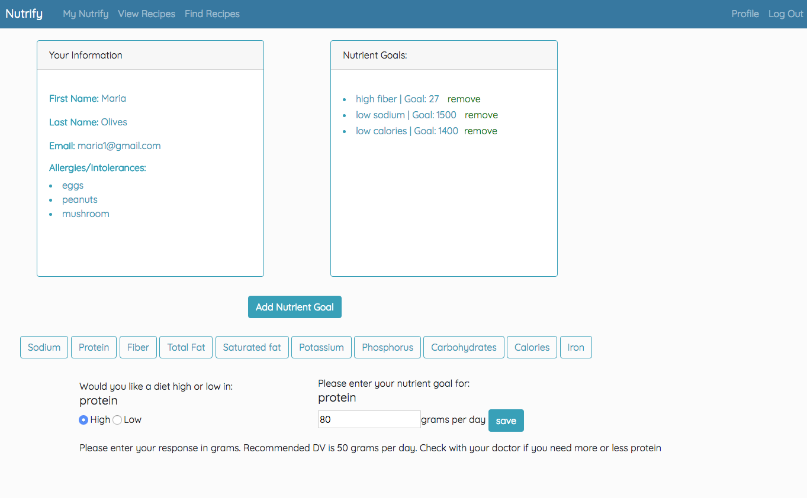
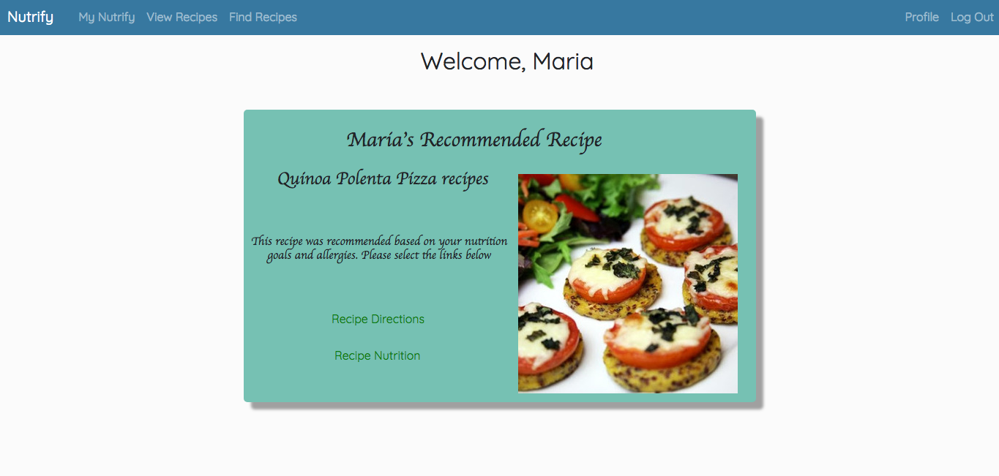
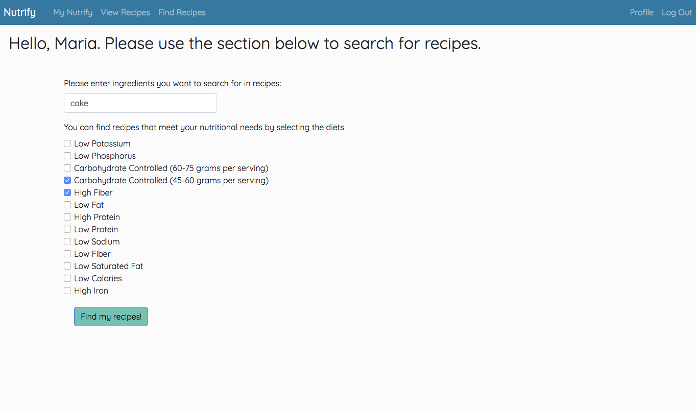
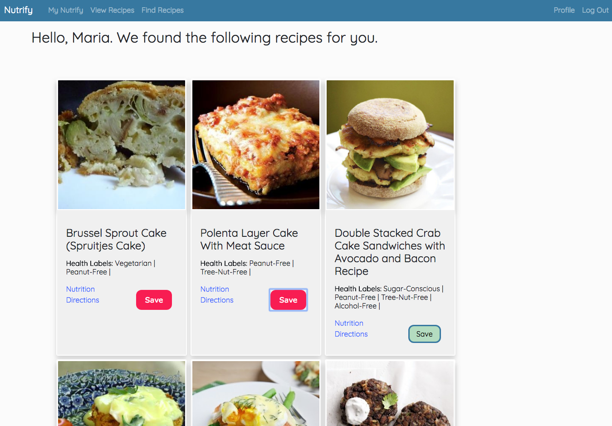

# Nutrify 

  Nutrify helps users find recipes based on diet restrictions and preferences, providing them with a multitude of options to meet their goals. The app uses flask and the Edamam API to search for recipes based on nutrient quantity (low sodium, high protein, etc) and recipe ingredients. Users can save recipes and analyze the nutritional components of a recipe, as well as modify servings to understand how the quantity increases the amount of a nutrient in their diet. Nutrify uses Chart.js to visualize how the amount of a nutrient in a recipe impacts a user's goal.

## Contents
* [Technology Stack](#technology-stack)
* [Features](#features)
* [Setup](#setup)
* [About the Developer](#about-the-developer)

### Technology Stack

Python, Flask, PostgreSQL, Jinja, SQLAlchemy, JavaScript (AJAX, JSON, Chart.js, jQuery), HTML, CSS, Bootstrap  

API: Edamam API        

### Features
Nutrify can be used by anyone, but is specifically targetted for users managing chronic diseases that require dietary restrictions.

Nutrify allows a user to: 
* set nutritional goals in his or her profile based on target micronutrients and/or macronutrients
* get a recommended recipe each time he or she logs in to the Nutrify app 
* search for recipes based on the amount of a nutrient as well as a recipe or ingredient keyword
* save recipes from search results and view saved recipes 
* change servings of a recipe to see how the serving size affects nutrient composition 
* analyze saved recipes to determine how a nutrient compares with his or her goals set in the profile section 

A user can add new nutritional goals the profile section. This feature using AJAX to add and remove new goals from database, as well as Javascript and JQUERY, to enhance user experience while on the page. 

A user can get a recommended recipe when logging in based on nutritional goals and allergies using an algorithm that queries the database on the backend and AJAX while the page loads to get a recommended recipe.

The app makes an API call to the Edamam API when the user searches for a micro- or macro-nutrient, and returns the results. 

All returned recipes are saved to the database on each call. However, the results are returned to the user directly from the parsed API results to avoid a second query of the database. When a user saves a recipe, a recipe becomed saved to a middle table connecting users and recipes. AJAX is used to a user can save multiple recipes while on the same page. 

###  Setup 

### About the Developer
Jessica is a software engineer and former dietitian based out of San Francisco. 
